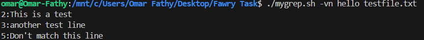
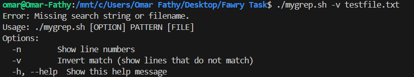
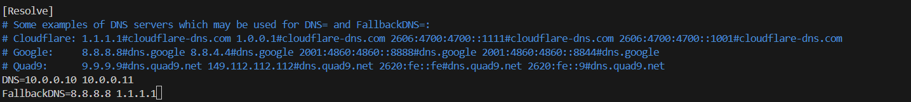

# 📋 mygrep.sh
`mygrep.sh` is a mini custom version of the `grep` command, written in Bash.  
It supports searching for a string in a text file with options for showing line numbers, inverting matches, and displaying help.

---

## ⚙️ Usage

```bash
./mygrep.sh [OPTION] PATTERN [FILE]
```

### Options:
- `-n` : Show line numbers
- `-v` : Invert match (show lines that **do not** contain the string)
- `-h` or `--help` : Display usage information

---

## 📸 Screenshots

**Test file** (`testfile.txt`) content:
```
Hello world
This is a test
another test line
HELLO AGAIN
Don't match this line
Testing one two three
```

---

### 1. `./mygrep.sh hello testfile.txt`


---

### 2. `./mygrep.sh -n hello testfile.txt`


---

### 3. `./mygrep.sh -vn hello testfile.txt`



---

### 4. `./mygrep.sh -v testfile.txt`

Expected: Script should warn about missing search string.



---

## 🧠 Reflective Section


### 1. **Breakdown: How the script handles arguments and options**

- The script first checks if `--help` is passed as an argument and immediately displays usage instructions.
- Then it uses `getopts` to parse short options like `-n`, `-v`, and `-h`.
- After options are processed, it **shifts** the arguments so that `$1` is the search string and `$2` is the filename.
- Input validation ensures both search string and filename are provided and that the file exists.
- During line-by-line reading:
  - It converts both the search string and file lines to lowercase to perform **case-insensitive matching**.
  - If `-n` is used, it prefixes matching lines with their line number.
  - If `-v` is used, it inverts the match logic.

---

### 2. **How the structure would change to support regex, `-i`, `-c`, or `-l` options**

- **Regex:**  
  Instead of simple `*string*` substring matching, I would use `[[ "$line" =~ $regex ]]` to allow full regular expression patterns.
- **`-i` (case-insensitive)**:  
  Right now, it’s always case-insensitive. To properly support `-i`, I would add a flag to control when to apply lowercasing.
- **`-c` (count matches)**:  
  Introduce a counter variable to increment for each match and only print the total count at the end.
- **`-l` (only filenames with matches)**:  
  If any match is found, just print the filename once and exit the loop early.

> Overall, adding these would require restructuring the script to **separate matching logic and output logic more cleanly** into different functions.

---

### 3. **Hardest Part and Why**

The hardest part was **properly handling option parsing with both short options (`-n`, `-v`) and the special `--help` long option**.  
Bash’s `getopts` does **not** natively support `--long-options`, so it required a manual pre-processing step before `getopts`, without breaking the rest of the script.  
Getting the order of shifting arguments right after `getopts` was also tricky to avoid mismatches between options and positional arguments.


# 🛠️ Troubleshooting: `internal.example.com` Unreachable

## 1. Verify DNS Resolution

**Check using system DNS:**
```bash
nslookup internal.example.com
```

**Force query using 8.8.8.8:**
```bash
nslookup internal.example.com 8.8.8.8
```

## 2. Diagnose Service Reachability

**Resolve IP and test connection:**
```bash
host internal.example.com
curl -v http://internal.example.com
```

**Check if the service is listening:**
```bash
sudo ss -tulnp | grep ':80\|:443'
```

## 3. Possible Causes

- Misconfigured DNS server
- Firewall blocking access
- Server IP change
- Web server not listening
- Incorrect `/etc/hosts` entries

## 4. Fixes

### Misconfigured DNS
**Check and fix resolv.conf:**
```bash
cat /etc/resolv.conf
sudo nano /etc/resolv.conf
```

### DNS Cache Issue
**Flush DNS:**
```bash
sudo systemd-resolve --flush-caches
```

### Firewall Blocking
**Allow HTTP/HTTPS:**
```bash
sudo firewall-cmd --permanent --add-service=http
sudo firewall-cmd --permanent --add-service=https
sudo firewall-cmd --reload
```

### Web Server Not Listening
**Restart web server:**
```bash
sudo systemctl restart nginx
```

### /etc/hosts Bypass (Bonus)
**Edit `/etc/hosts`:**
```bash
sudo nano /etc/hosts
```
Add:
```
192.168.1.50 internal.example.com
```


## Bonus: Persist DNS Settings

**systemd-resolved:**
```bash
sudo vim /etc/systemd/resolved.conf
```
Set:
```
DNS=10.0.0.10 10.0.0.11
FallbackDNS=8.8.8.8 1.1.1.1
```

Restart service:
```bash
sudo systemctl restart systemd-resolved
```


